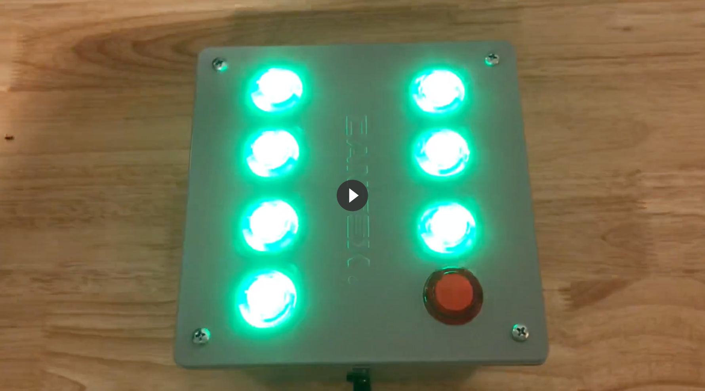

# Arduino Task Tracker

An Arduino powered Task Tracker using LED arcade buttons.  Keeps track of a daily task such as brushing your teeth over the course of one week.  If you want a much cooler version that tracks a whole year, check out [Simone's Every Day Calendar Kickstarter](https://www.kickstarter.com/projects/simonegiertz/the-every-day-calendar).

This uses 8 LED arcade buttons from Adafruit, an Arduino Uno and the C code in this repo.  The seven green buttons are wired up to the digital pins on the Arduino.  The red button is wired direct to the reset pins and reboots the Arduino when pressed.

Here's a video of it working...

This makes use of the [Bounce 2 button debouncing library](http://thomasfredericks.github.io/Bounce2/files/index.html) for Arduino.

The code is intentionally simpler than perhaps it could be, as the target audience was my 7 year old son.
